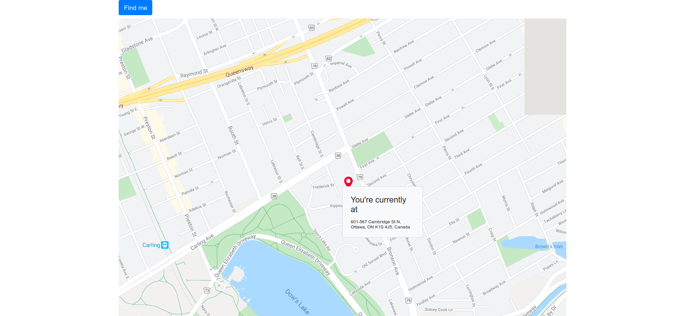

# Find my Location

This app finds your location at the click of a button and displays your exact address.



## Built With

- React
- Google Maps API and Geolocation API
- Google-map-react NPM package
- Boostrap

## Getting Started

- run

```
npm install
```

to install all packages. then

```
npm start
```

- to start the app in the browser.

### Automated tests

- This app currently does not have any automated tests. Tests will be written at a later date.

### Planned Features

- Allow users to order food without typing in their address.

## Authors

👤 **Adebola**

- Github: [@githubhandle](https://github.com/onedebos)
- Twitter: [@twitterhandle](https://twitter.com/debosthefirst)
- Linkedin: [linkedin](https://www.linkedin.com/in/adebola-niran/)

## 🤝 Contributing

Contributions, issues and feature requests are welcome!

Feel free to check the [issues page](issues/).

## Show your support

Give a ⭐️ if you like this project!

## Acknowledgments

## 📝 License

This project is [MIT](lic.url) licensed.
